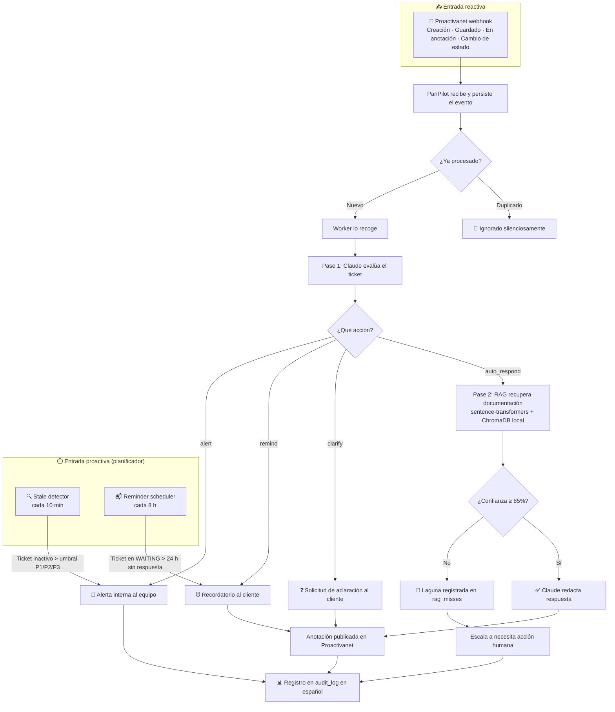

<div align="center">

# 🤖 PanPilot

### El copiloto de IA que convierte tu mesa de ayuda en una operación de alto rendimiento

**Responde tickets de L1 automáticamente · Detecta lagunas en tu documentación · Nunca pierde un SLA**

---

[](https://python.org)
[](https://fastapi.tiangolo.com)
[](https://anthropic.com)
[](https://trychroma.com)
[](https://sqlite.org)
[](https://nginx.org)
[](tests/)
[](CHANGELOG.md)

</div>

---

## ¿Qué hace PanPilot?

Tu equipo de soporte dedica horas al día en trabajo que no requiere criterio humano: pedir información obvia que falta en el ticket, responder la misma pregunta sobre el agente de AD por décima vez, perseguir técnicos que no respondieron, y descubrir que un P1 lleva 6 horas sin movimiento.

**PanPilot elimina ese trabajo por completo.**

Se conecta a Proactivanet mediante webhook, evalúa cada ticket con Claude AI, y actúa — respondiendo, preguntando, recordando o alertando — antes de que ningún agente haya siquiera abierto la interfaz. Cuando el ticket llega al equipo, ya tiene contexto, o ya está resuelto.

---

## 📊 Impacto en el negocio

| Métrica | Sin PanPilot | Con PanPilot |
|--------|-------------|--------------|
| Tickets L1 resueltos sin intervención humana | 0 % | hasta 30–40 % |
| Tiempo promedio hasta primera respuesta | Variable (depende de carga) | Segundos |
| Tickets que superan SLA sin que nadie lo note | Frecuente | Alerta automática antes del vencimiento |
| Preguntas repetidas de "no tenemos documentación" | Invisibles | Registradas, categorizadas y priorizadas |
| Recordatorios enviados manualmente | Horas de seguimiento | Cero |
| Aclaraciones redundantes enviadas al mismo cliente | Sin límite | Máximo 2 por ticket, 3 por organización cada 3 días |

> **Una operación de soporte que responde en segundos para preguntas documentadas y nunca pierde un SLA es una ventaja competitiva directa.**

---

## ⚡ Cuatro comportamientos de automatización

### 1. 💬 Respuesta automática L1 — con respaldo documental

Cuando llega un ticket cuya solución está en la documentación técnica, PanPilot lo resuelve solo. Recupera los fragmentos relevantes de la base de conocimiento, los evalúa con Claude AI, y publica la respuesta directamente en Proactivanet — todo en segundos, sin intervención humana.

**Cómo garantiza calidad:** el umbral de confianza configurable (por defecto 85 %) asegura que PanPilot solo responde cuando está seguro. Si la confianza es menor, escala correctamente en lugar de inventar una respuesta.

**Para el negocio:** cada ticket L1 resuelto automáticamente libera ~15 minutos de tiempo de agente. En una mesa de 50 tickets diarios, eso es potencialmente 125 horas recuperadas por semana.

---

### 2. 🔍 Solicitudes de aclaración — cuando el ticket no tiene suficiente información

Si el ticket llega sin la información necesaria para diagnosticar el problema, PanPilot hace una sola pregunta concreta al solicitante y espera. Sin burocracia, sin "cierre el ticket y abra uno nuevo."

**Protección integrada:** máximo 2 solicitudes por ticket. Si después de dos intentos el cliente no responde, escala a necesita acción humana. El cliente no recibe un interrogatorio; recibe exactamente lo que necesita para ayudarle.

---

### 3. ⏰ Recordatorios automáticos — sin perseguir a nadie

Cuando un técnico envía una respuesta al cliente y este no contesta, PanPilot detecta la espera y envía un recordatorio proactivo al solicitante sin que ningún coordinador tenga que hacer seguimiento manual.

**Dos mecanismos en paralelo:** cuando el webhook de `En anotación` llega y confirma que un técnico contactó al cliente, el ticket pasa a estado WAITING. El planificador revisa cada 8 horas si algún ticket en WAITING lleva más de 24 horas sin respuesta del cliente — y si es así, envía el recordatorio automáticamente, aunque no haya habido ningún evento de Proactivanet en ese intervalo.

**Control anti-spam:** máximo 2 recordatorios por ticket. A nivel de organización, si el mismo solicitante ha recibido 3 recordatorios en los últimos 3 días en distintos tickets, PanPilot escala en lugar de seguir enviando mensajes. Sin spam, sin fatiga de notificaciones.

---

### 4. 🚨 Detección de tickets inactivos — ningún SLA se rompe en silencio

Un detector programado **se ejecuta cada 10 minutos** y revisa el estado de los tickets abiertos. Cuando un ticket supera el umbral de inactividad según su prioridad, PanPilot registra una alerta interna y notifica al equipo antes de que el SLA se rompa.

| Prioridad | Umbral de inactividad |
|----------|----------------------|
| 🔴 P1 — Crítico | 4 horas |
| 🟡 P2 — Alto | 24 horas |
| 🟢 P3 — Normal | 120 horas (5 días) |

**Sin duplicados:** una vez alertado, el ticket no vuelve a alertar hasta que el umbral se cumple de nuevo. La máquina de estados garantiza que cada alerta sucede exactamente una vez.

---

## 🖥️ Panel de administración

Accesible en `/admin/` con autenticación HTTP Basic Auth. El panel tiene tres pestañas: **Auditoría**, **Lagunas de documentación**, y **Cola de errores (DLQ)**.

### 📋 Registro de auditoría completo

Cada decisión que PanPilot toma queda registrada: el ticket, la acción ejecutada, el razonamiento de Claude en español, el nivel de confianza, el borrador de respuesta, y si la acción fue real o en modo simulación (`DRY_RUN`). Nada ocurre sin dejar huella.

```
┌─────────────────┬─────────────┬─────────────┬────────────┬─────────────────────────────────────┐
│ Ticket          │ Acción      │ Confianza   │ Modo       │ Razonamiento                        │
├─────────────────┼─────────────┼─────────────┼────────────┼─────────────────────────────────────┤
│ INC 2026-000026 │ auto_respond│ 0.90        │ live       │ La documentación cubre el agente... │
│ INC 2026-000025 │ clarify     │ —           │ live       │ El ticket no especifica el módulo...│
│ INC 2026-000024 │ remind      │ —           │ live       │ El técnico asignado lleva 26h...    │
└─────────────────┴─────────────┴─────────────┴────────────┴─────────────────────────────────────┘
```

Cada entrada enlaza directamente al ticket en Proactivanet. El razonamiento completo siempre es visible — sin truncamiento.

### 🗺️ Pestaña: Lagunas de documentación

Cuando PanPilot intenta responder un ticket automáticamente y no tiene suficiente documentación para hacerlo con confianza, registra la pregunta en la tabla de **lagunas de documentación** (`rag_misses`). Claude categoriza automáticamente cada laguna y explica por qué la documentación existente fue insuficiente.

```
┌────────────────────────────────────┬──────────┬──────────────────────────────────────────────┐
│ Categoría                          │ Tickets  │ Ejemplo de explicación                       │
├────────────────────────────────────┼──────────┼──────────────────────────────────────────────┤
│ Configuración de webhooks          │    8     │ La doc cubre el setup básico pero no los...  │
│ Integración con Active Directory   │    5     │ No hay documentación sobre el caso de...     │
│ Roles y permisos en Proactivanet   │    3     │ La guía de roles no cubre los permisos...    │
└────────────────────────────────────┴──────────┴──────────────────────────────────────────────┘
```

**Para el negocio:** este informe es oro puro para el equipo de documentación. En lugar de adivinar qué documentar a continuación, priorizas exactamente lo que está causando tickets de soporte repetitivos — con datos reales, no suposiciones.

### 🔄 Cola de errores (DLQ) con reintento

Los eventos que fallan se encolan con backoff exponencial (30 s → 5 min → 30 min). Desde el panel de administración puedes reintentar cualquier entrada con un clic, sin tocar el servidor.

---

## 🔄 Cómo funciona



**Garantías de confiabilidad:**
- 📌 El evento se escribe en SQLite **antes** de procesarse — nunca se pierde aunque el proceso caiga
- 🔁 Recuperación automática al reiniciar — los eventos no procesados se recogen sin configuración manual
- 🛡️ Inyección de prompts bloqueada — el contenido del ticket se aísla en delimitadores XML con `html.escape()`
- 🔒 Webhook autenticado con secreto compartido via `secrets.compare_digest` (comparación en tiempo constante)

---

## 🧠 Impulsado por Claude AI + RAG

PanPilot usa un pipeline de evaluación en dos pasos diseñado para responder con precisión o no responder:

**Pase 1 — Clasificación:** Claude analiza el ticket y decide si la pregunta es respondible desde documentación (`auto_respond`), necesita más información (`clarify`), requiere seguimiento (`remind`), o necesita atención inmediata (`alert`).

**Pase 2 — Recuperación y respuesta:** Solo si el Pase 1 clasifica como `auto_respond`, se activa el pipeline RAG:

1. El título y descripción del ticket se convierten en un vector de 384 dimensiones usando **`all-MiniLM-L6-v2`** — modelo local, sin enviar datos a terceros para el embedding
2. ChromaDB recupera los 5 fragmentos más relevantes de la base de conocimiento (`pandocs`)
3. Claude evalúa ticket + fragmentos y produce una respuesta con nivel de confianza explícito (0.0–1.0)
4. Si la confianza ≥ umbral configurado (por defecto 85 %): respuesta publicada ✅
5. Si la confianza < umbral: la laguna queda registrada con categoría y explicación ❌

**Razonamiento siempre en español:** tanto el Pase 1 como el Pase 2 están configurados para que Claude escriba su razonamiento en español. El registro de auditoría es legible por el equipo sin necesidad de traducción.

---

## 🛠️ Stack tecnológico

<table>
<tr>
<td align="center"><strong>🌐 Servidor web</strong><br/>FastAPI 0.115<br/><em>Async nativo, 200 antes de evaluar</em></td>
<td align="center"><strong>🤖 Motor de IA</strong><br/>Claude AI (Anthropic)<br/><em>Haiku para traducción, Sonnet para evaluación</em></td>
<td align="center"><strong>🔍 Búsqueda vectorial</strong><br/>ChromaDB 1.5+<br/><em>Embeddings locales, sin GPU</em></td>
</tr>
<tr>
<td align="center"><strong>🗄️ Base de datos</strong><br/>SQLite con WAL<br/><em>Concurrencia lectura/escritura</em></td>
<td align="center"><strong>⏱️ Planificador</strong><br/>APScheduler 3.x<br/><em>SQLite job store, coalesce=True</em></td>
<td align="center"><strong>🔒 Infraestructura</strong><br/>systemd + nginx + TLS<br/><em>certbot, path allowlist</em></td>
</tr>
</table>

**Modelo de embeddings:** `sentence-transformers/all-MiniLM-L6-v2` — 384 dimensiones, 256 tokens, CPU. Sin dependencia de GPU, funciona en cualquier VPS estándar.

---

## 🚀 Inicio rápido

### Requisitos

- Python 3.12 y `uv`
- Cuenta de Anthropic (API key)
- Instancia de Proactivanet con acceso a la API
- Dominio con certificado TLS (certbot)

### Instalación

```bash
# 1. Clonar
git clone git@github.com:FJCF76/panpilot.git && cd panpilot

# 2. Instalar dependencias
uv sync

# 3. Configurar variables de entorno
cp .env.example .env && chmod 600 .env
# Editar .env con las credenciales reales
```

### Variables de entorno mínimas

```env
PROACTIVANET_API_URL=https://tu-instancia.proactivanet.com/api
PROACTIVANET_API_KEY=...
PROACTIVANET_AUTHOR_ID=...       # UUID del técnico PanPilot en Proactivanet
PROACTIVANET_BASE_URL=https://tu-instancia.proactivanet.com
ANTHROPIC_API_KEY=...
ADMIN_PASSWORD=...               # Contraseña para /admin
DRY_RUN=true                     # Validar en modo simulación antes de activar
```

### Despliegue

```bash
# Servicio systemd
sudo cp deploy/panpilot.service /etc/systemd/system/
sudo systemctl daemon-reload && sudo systemctl enable --now panpilot

# nginx + TLS
sudo cp deploy/panpilot-nginx.conf /etc/nginx/sites-available/panpilot
sudo ln -s /etc/nginx/sites-available/panpilot /etc/nginx/sites-enabled/
sudo certbot --nginx -d tu-dominio.com && sudo systemctl reload nginx

# Verificar
sudo systemctl status panpilot
journalctl -u panpilot.service -n 50 -f
```

### Indexar la base de conocimiento (RAG)

```bash
# Colocar documentos Markdown en ~/pandocs
# Indexar en ChromaDB (operación única, re-ejecutar cuando añadas docs)
uv run python scripts/index_pandocs.py

# Verificar el pipeline completo
uv run python scripts/rag_smoke_test.py
```

### Modo simulación → Modo live

PanPilot arranca con `DRY_RUN=true`: evalúa todos los tickets y registra cada decisión en el log de auditoría, pero **no escribe en Proactivanet**. Ideal para validar el comportamiento antes de activar.

```bash
# Tras validar en el panel de administración:
# Editar .env → DRY_RUN=false
sudo systemctl restart panpilot
```

---

## 🗺️ Roadmap — v0.4.0

Lo que viene después:

| Funcionalidad | Descripción |
|--------------|-------------|
| 🔄 **Gestión de seguimientos** | Manejo del ciclo completo de respuesta al cliente: cuando el cliente responde a una aclaración, PanPilot retoma el hilo automáticamente |
| 🏢 **Soporte multi-instancia** | Una sola instalación de PanPilot gestionando múltiples instancias de Proactivanet simultáneamente — ideal para MSPs y empresas con múltiples entornos |
| 📧 **Alertas de DLQ exhausted** | Notificación proactiva (correo o webhook) cuando una entrada de la cola de errores se agota — sin necesidad de monitorear `journalctl` manualmente |
| 🏷️ **Exclusión manual activada** | Campo personalizado de Proactivanet para marcar tickets que PanPilot debe ignorar completamente |

---

## 📚 Documentación técnica

- [`docs/ARCHITECTURE.md`](docs/ARCHITECTURE.md) — arquitectura de tres capas, máquina de estados, modelo de datos, decisiones de diseño
- [`CHANGELOG.md`](CHANGELOG.md) — historial completo de versiones

---

<div align="center">

**PanPilot** · Automatización inteligente para Proactivanet S.A.

*Construido con [Claude AI](https://anthropic.com) · [FastAPI](https://fastapi.tiangolo.com) · [ChromaDB](https://trychroma.com)*

</div>
